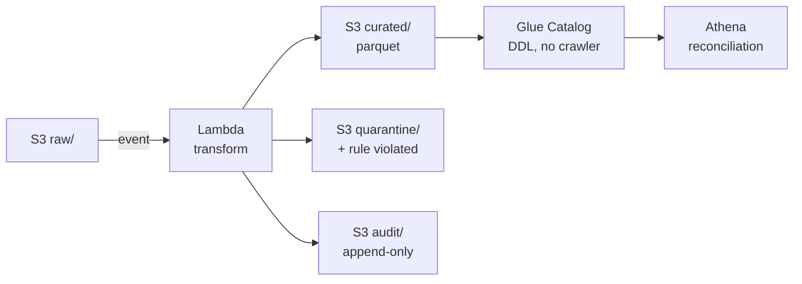

<div align="center">

# Data Migration Validation Pack

**Legacy blood-screening LIS → AWS, in a GxP-regulated context.**

Documents that a regulator would accept, over code that actually runs.

### → [javoo-bot.github.io/test-AWS](https://javoo-bot.github.io/test-AWS/)

<sub>The pack, read in two minutes · [mirror](https://signal-to-cutoff.huertos-madrid.workers.dev)</sub>

</div>

---

## The scenario

Five years of donor screening records migrate off a Laboratory Information System being decommissioned.

In blood screening the assay result decides whether a unit is **released for transfusion or destroyed**. That single fact sets the test depth for every field in the pack — the risk argument is not an opinion.

## Nine defects, injected on purpose

A validation pack where everything passes has proved nothing.

| | Defect | Why it happens |
|---|---|---|
| `DEF-01` | Legacy assay codes with no target equivalent | Every legacy LIS grows proprietary codes |
| `DEF-02` | Haemoglobin `g/dL` → `g/L` | Wrong by 10×, perfectly well-formed |
| `DEF-03` | `<0.10`, padded, comma decimals | Results held as free text |
| `DEF-04` | Names double-encoded at rest | Corruption predating the project |
| `DEF-05` | Wall-clock times, two offsets, DST fallback | Source schema has no offset column |
| `DEF-06` | Duplicate donation identifiers | Historical site-database merge |
| `DEF-07` | Orphan results | Extract windows not taken atomically |
| `DEF-08` | Sentinel `9999` = "not performed" | Absent from the data dictionary |
| `DEF-09` | Manifest total ≠ file contents | Count taken before the last flush |

> **DEF-04 is the instructive one.** The corrupted rows are the ones that *look correct* read as UTF-8; the clean rows look broken. That inversion is why it survives visual review and reaches production. Six of five hundred donors — invisible to the eye, provable at the byte level.

## Architecture



**No Glue crawler.** Crawlers bill $0.44/DPU-hour and *infer* schema. Tables come from DDL derived from `STTM-001`, so the catalogue is traceable to the mapping spec rather than to a scanner's guess.

**Athena stands in for the client's warehouse.** Controls are ANSI SQL and port unchanged. The substitution is recorded in `CS-001`, not left implicit.

## Two findings from building it

Both are the failure mode this pack exists to catch — a control that looks like a control.

**An IAM `Deny` that never fires.** The policy restricted Lambda memory via `lambda:MemorySize`. That condition key does not exist. Two more denies used invalid service prefixes. All three would have sat there matching nothing.

**A negative test that could not fail.** Denials were tested by calling non-existent resources. S3 answers `NoSuchBucket`, indistinguishable from a denial — the probe passed on an inconclusive result. Rewritten against the IAM policy simulator, which returns the decision itself and separates *explicit* deny from *implicit*.

## Layout

```
docs/03-mapping/STTM-001…    source-to-target mapping — the single source of truth
infra/provision/             CS-001 config spec, provisioner, two qualification checks
src/legacy_sim/              deterministic extract generator + defect catalogue
src/migration/               transform, quarantine, audit trail
src/reconciliation/          completeness · accuracy · integrity controls
evidence/                    execution records — the deliverable, not a by-product
```

`STTM-001` feeds the transform, the controls **and** the traceability matrix. A mapping spec kept separately from its code drifts from it; here it *is* the input, so they cannot silently disagree.

## Status

| | |
|---|---|
| Legacy extract, 9 defects, byte-verified | ✅ 15.8k rows |
| `STTM-001` mapping · `CS-001` config spec | ✅ 43 fields, 14 critical |
| `IQ-AUTH` credential scope | ✅ 23/23 |
| `IQ-CONFIG` as-built vs as-designed | 🟡 32/33 · [open deviation](#) — no SNS subscriber |
| Transform · reconciliation controls | 🔨 |
| URS/FS · RTM · risk assessment · ALCOA+ | 📋 |

## Cost

**$0.00.** Lambda, Glue Catalog, CloudWatch, SNS are always-free. Athena is the only non-zero line at ~$0.00005/query. Three enforced controls: IAM explicitly denies every billable service (`IQ-AUTH-B07`–`B13`), the Athena workgroup caps scans at 100 MB/query, and a $1 budget acts as a tripwire rather than an allowance.

<sub>Account identifiers in `evidence/` are redacted for publication — verdicts and timestamps unaltered. Synthetic data throughout; no real patient records.</sub>
